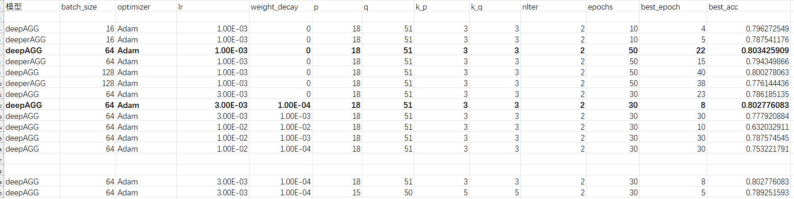
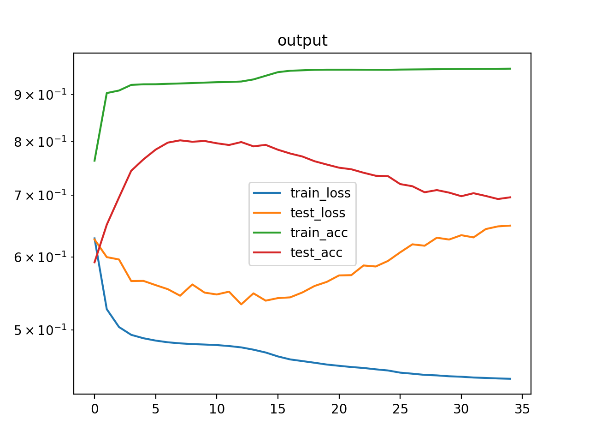

# deepAGG

> 参考文献：Alexander L. Gaunt et al. “Training deep neural nets to aggregate crowdsourced responses” uncertainty in artificial intelligence (2016): n. pag.

论文中4.6 Computing Support for a Given Answer 采用了两种方法：概率分数和神经网络，分别对应了**deepAGG.py**和**deeperAGG.py**

## 相关超参
| 超参名 | 含义                 | 默认值 |
| ------ | -------------------- | ------ |
| p      | 采样的众包工作者个数 | 18     |
| q      | 采样的问题个数       | 51     |
| k_p    | 众包工作者分组组数   | 3      |
| k_q    | 问题分组组数         | 3      |
| nIter  | 算法迭代次数         | 2      |
| runs   | 采样次数             | 10000  |

- p必须整除k_p，q必须整除k_q
- runs代表采样次数，代码中我是把runs设置成了dataset长度，相当于每次取batchsize个采样进行梯度回传。

## 调参情况

## 分析

- 过拟合现象较严重

    下图是其中一次的训练和测试的损失精度变化情况

    deepAGG，batchsize=64，lr=3e-3，weight_decay=1e-4

    训练集精度一下就到0.9，测试集精度有时会慢慢上升，有时第一个迭代直接开始下降（与超参有关），不管怎样最终的损失和精度都相差很大。

    

- deeperAGG与deepAGG相比没有任何优势，反而更差。
  
    这点在论文里也是一样的，论文中实验的部分也是使用没有神经网络的版本，只用了一句话题了一下：
    > We have also run DeepAgg with the neural net implementation for the second block, with an almost identical performance, indicating that both are reasonable choices for that block.

- 数据集要求是完备的，即每个众包工作者需要回答所有的问题

    目前只有`SpectralMethodsMeetEM/bluebird`和`crowd_truth_inference/d_Duck Identification`可以用，而且这两个数据集是一样的

- deeperAGG时间上与deepAGG相差不大，用cuda加速反而变慢
  - 代码中for比较多，必须cpu运行的代码多
  - 可能是我代码写错或写的太丑